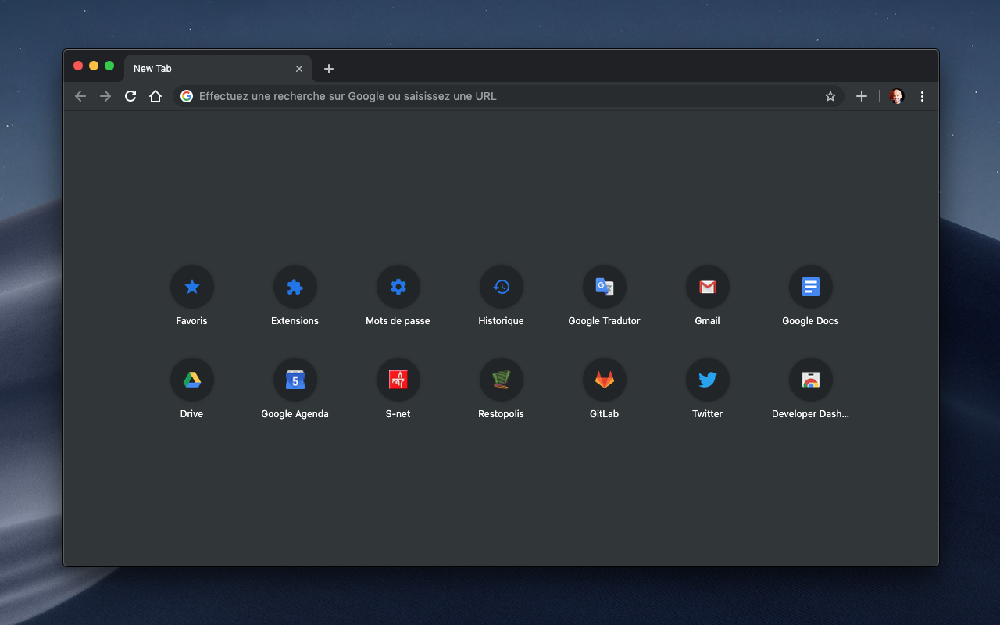

# chrome-ext-ntp-bookmarkers

Override the new tab page with the bookmarks.

This extension shows the bookmarks overview when opening a new tab in Chrome.

Add to Chrome : [chrome web store
](https://chrome.google.com/webstore/detail/new-tab-page-bookmarks/jafnapncbaamdiooljaibpebonjpgffe)

🚀 New !!! Support dragging and dropping to change the order :

https://www.youtube.com/watch?v=gda9ufFVqYo

